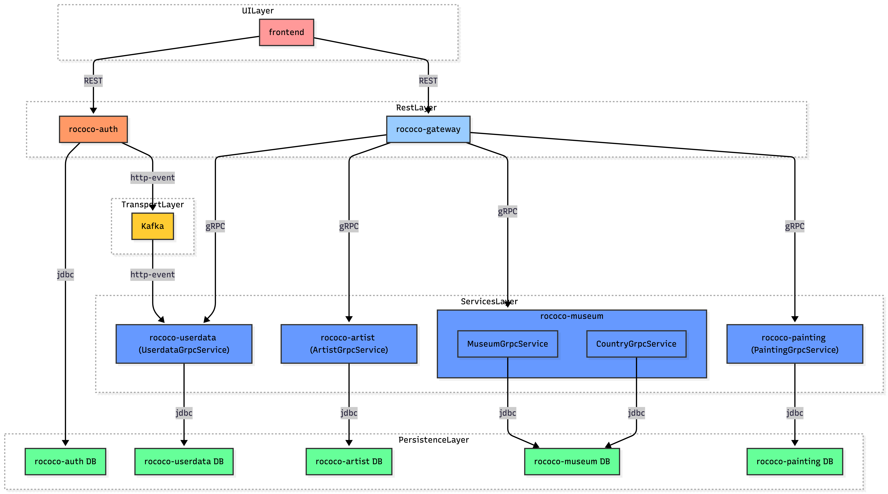

# Rococo

**Система управления музейными коллекциями**

Rococo — учебный микросервисный проект для управления музеями, художниками и произведениями искусства. Решение ориентировано на масштабируемость, событийное взаимодействие и сквозное тестирование.


---

## Кратко о проекте

* **Назначение**: управление музейными данными (музеи, художники, картины, пользователи)
* **Архитектура**: микросервисы + API Gateway
* **Коммуникации**: REST, gRPC, события (Kafka)
* **Стек**: Java 21, Spring Boot 3, PostgreSQL, Svelte
* **Контекст**: дипломный проект QA.GURU Java Advanced 2.0

---

## Архитектурная модель



---

## Сервисы

| Сервис          | Роль                         | Порт |
| --------------- | ---------------------------- |------|
| rococo-gateway  | Единая точка входа API       | 8080 |
| rococo-auth     | Аутентификация и авторизация | 9000 |
| rococo-userdata | Профили пользователей        | 9094 |
| rococo-artist   | Художники                    | 9095 |
| rococo-painting | Картины и произведения       | 9097 |
| rococo-museum   | Музеи и страны               | 9096 |
| rococo-client   | Frontend (Svelte)            | 80   |

---

## Инфраструктура

### Runtime

* **PostgreSQL** — отдельная БД на сервис
* **Apache Kafka** — событийная шина
* **Zookeeper** — координация Kafka
* **Docker / Docker Compose** — окружение

### Тестовая среда

* **Selenoid** — браузеры для UI-тестов
* **Allure** — сбор и визуализация отчетов

---

## Технологии

### Backend

* Java 21
* Spring Boot 3 (Web, Security, Data JPA)
* gRPC
* Apache Kafka
* Flyway

### Frontend

* Svelte
* Node.js

### Тестирование

* JUnit 5
* Selenide
* WireMock
* Allure

---

## Запуск проекта

### Требования

* Java 21+
* Docker и Docker Compose
* Node.js 22+
* Git

### Docker (рекомендуется)

0. Создать docker volume: `pgdt` (для БД) и `allure-results` (для отчетов)
1. Создать бесплатную учетную запись на https://hub.docker.com/ (если отсутствует)
2. Выполнить docker login с созданным access_token (в инструкции это описано)
3. Прописать в etc/hosts элиас для Docker-имени

- frontend:  127.0.0.1 frontend.rococo.dc,
- auth:      127.0.0.1 auth.rococo.dc
- gateway:   127.0.0.1 gateway.rococo.dc
- allure:    127.0.0.1 allure

```bash
vim /etc/hosts
```

```bash
##
# Host Database
#
# localhost is used to configure the loopback interface
# when the system is booting.  Do not change this entry.
##
127.0.0.1       localhost
127.0.0.1       frontend.rococo.dc
127.0.0.1       auth.rococo.dc
127.0.0.1       gateway.rococo.dc
127.0.0.1       allure
```

# Сборка и запуск всех сервисов

#### Запуск в Docker (рекомендуется)

0. Создать docker volume: `pgdata` (для БД) и `allure-results` (для отчетов)
1. Создать бесплатную учетную запись на https://hub.docker.com/ (если отсутствует)
2. Выполнить docker login с созданным access_token (в инструкции это описано)
3. Прописать в etc/hosts элиас для Docker-имени

- frontend:  127.0.0.1 frontend.rococo.dc,
- auth:      127.0.0.1 auth.rococo.dc
- gateway:   127.0.0.1 gateway.rococo.dc
- allure:    127.0.0.1 allure

```bash
vim /etc/hosts
```

```bash
##
# Host Database
#
# localhost is used to configure the loopback interface
# when the system is booting.  Do not change this entry.
##
127.0.0.1       localhost
127.0.0.1       frontend.rococo.dc
127.0.0.1       auth.rococo.dc
127.0.0.1       gateway.rococo.dc
127.0.0.1       allure
```
4. Запустить скрипт
```bash
# Сборка и запуск всех сервисов
./docker-compose-dev.sh

# Или с отправкой образов в registry
./docker-compose-dev.sh push
```

**Проверка статуса:**
```bash
docker ps -a
```

Фронтенд rococo при запуске в докере будет работать для вас по адресу http://frontend.rococo.dc

### Локальная разработка

1. Поднять инфраструктуру:

```bash
./localenv.sh
```

2. Запуск сервисов с профилем `local`:

```bash
./gradlew :rococo-gateway:bootRun -Dspring.profiles.active=local
```

3. Frontend:

```bash
cd rococo-client
npm i
npm run dev
```

UI: `http://127.0.0.1:3000`

---

## Тестирование

### Набор тестов

* **E2E**: Web / REST / gRPC
* **Unit**: сервисные тесты (пример — rococo-museum)

### Запуск E2E в Docker

```bash
./docker-compose-e2e.sh
```

Отчет Allure: `http://allure:5252`

### Локальный запуск

```bash
./gradlew test
./gradlew :rococo-e-2-e-tests:test
```

---

## Структура репозитория

```
rococo/
 ├─ rococo-gateway
 ├─ rococo-auth
 ├─ rococo-userdata
 ├─ rococo-artist
 ├─ rococo-painting
 ├─ rococo-museum
 ├─ rococo-client
 ├─ rococo-e-2-e-tests
 ├─ grpc-common
 └─ infrastructure
```

---

## Конфигурация

* Переменные окружения: `docker.properties`
* Префикс образов: `IMAGE_PREFIX`
* Профили docker-compose: `docker`, `test`

---

## Диагностика

* Логи: `docker compose logs -f`
* Health:

  * Gateway: `/actuator/health`
  * Auth: `/actuator/health`

---

## Лицензия и авторы

Проект создан в образовательных целях.

* **Автор**: Dmitrii Tuchs
* **Мейнтейнер**: Denis Usoltsev
* **Версия**: 1.0

---

**Rococo** — практический пример современной микросервисной системы с полным циклом разработки и тестирования.
